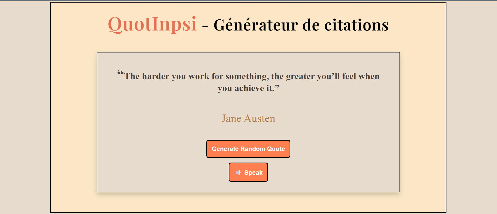

# ✨ QuotInpsi - Générateur de citations

<p align="center">
  
</p>
---
## What is quotInspi?

What is QuotInspi?

QuotInspi is a simple and attractive web application that provides users with inspirational quotes in a clean and minimalist interface. It's designed for those times when you need motivation, reflection, or something meaningful to read or hear.

The project aims to merge inspiration and accessibility. Not only does the app display random quotes, but it also uses the browser's built-in text-to-speech capabilities to read them aloud, making the experience more dynamic and inclusive.

The project also serves as an educational foundation, demonstrating how to build a responsive application, manage random data, and integrate web APIs, such as text-to-speech, while remaining open source and open to collaboration.
---
## 🚀 Features (MVP)

This version of **quotInspi** represents the Minimum Viable Product (MVP): a simple and functional base that delivers the core experience with clean implementation and a focus on usability.

### ✅ Core Features:
- 🎯 **Random inspirational quote** displayed on page load
- 🔁 **"New Quote" button** to generate a different quote on demand
- 🔊 **Text-to-Speech (TTS)**: the app reads the quote aloud using the browser’s Speech Synthesis API
- 💡 **Clean UI** with responsive layout using pure CSS
- ⚡ **Fast performance** thanks to Vite and lightweight codebase

### 🛠️ Tech Stack:
- **React** – Component-based architecture for UI rendering
- **Vite** – Ultra-fast development environment
- **Vanilla CSS** – Custom styling without frameworks
- **Web Speech API** – For TTS functionality in the browser
---
## 🔗 Live Demo
Try it here: [quotInspi Live](https://tonlien.vercel.app)

<h2>🎥 Demo Preview</h2>

<video width="100%" height="auto" controls>
  <source src="./public/Demo.mp4" type="video/mp4">
  Your browser does not support the video tag.
</video>
---
## 🛠️ Installation

Follow these steps to run the project locally on your machine.

### 1. Clone the repository

```bash
git clone https://github.com/LaudeDignus/quotInspi.git
cd quotInspi
```

### 2. Install dependencies

```bash
npm install
```

### 3. Start the development server
```bash
npm run dev
```

---
## 📦 Prerequisites & Dependencies

Before running the project, make sure your environment meets the following requirements:

### 🔧 Prerequisites

- **Node.js** – version 16 or higher  
  [Download Node.js](https://nodejs.org/)
- **npm** – comes with Node.js

To check if they are installed, run:

```bash
node -v
npm -v
```
---
## 🛣️ Roadmap

This is a progressive roadmap for improving quotInspi beyond the MVP. Features are grouped by priority/stage.

### ✅ Core Features (Completed)
- ✅ Display random quotes on page load
- ✅ Read quotes aloud using the Web Speech API (TTS)
- ✅ Button to generate a new quote
- ✅ Responsive layout using vanilla CSS
- ✅ Built with React + Vite

---

### 🔜 Goals
- 🔲 Add quote **categories** (e.g. motivation, love, humor, philosophy)
- 🔲 Add **background images** or illustrations to enhance quote visuals
- 🔲 Add **dark mode / theme toggle**
- 🔲 Improve quote transitions (fade-in, slide, etc.)
- 🔲 Add **"Copy to clipboard"** button for quotes
- 🔲 Basic internationalization (English/French)
- 🔲 Add **quote search** or filter by category/tag
- 🔲 Enable **user-submitted quotes** via a form
- 🔲 Add a **“Favorite” button** and store favorites in LocalStorage
- 🔲 Social sharing buttons:
  - 🔲 Share quote as **text** on Twitter/X, Facebook, LinkedIn
  - 🔲 Share quote as **image** (generated card)
- 🔲 Auto-play daily quote (quote of the day)
- 🔲 Generate **shareable quote cards** as images (Canvas or HTML2Image)
- 🔲 Export favorite quotes to PDF
- 🔲 Deploy mobile app version (React Native / PWA)
- 🔲 Integrate AI to generate new quotes
- 🔲 Use text classification to suggest related quotes

> Priorities may shift based on user feedback and contributions. Feel free to suggest new ideas by opening an issue or discussion!
---

## 🤝 Contributing

Contributions are welcome!  
Whether you're fixing a bug, adding a new feature, or just improving documentation, feel free to open a pull request or start a discussion.

To contribute:

1. Fork the repository
2. Create a new branch (`git checkout -b feature/my-feature`)
3. Commit your changes (`git commit -m 'Add some feature'`)
4. Push to the branch (`git push origin feature/my-feature`)
5. Open a Pull Request

---
## 👤 Author

Made with ❤️ by [@LaudeDignus](https://github.com/LaudeDignus)  
Contact: [LinkedIn](https://www.linkedin.com/in/mouhamed-wade-97a967345/))
---
## 🙏 Special Thanks

**CodeDex** – for the inspiration, learning resources, and community that helped bring this project to life  
  → [https://www.codedex.io](https://www.codedex.io)
